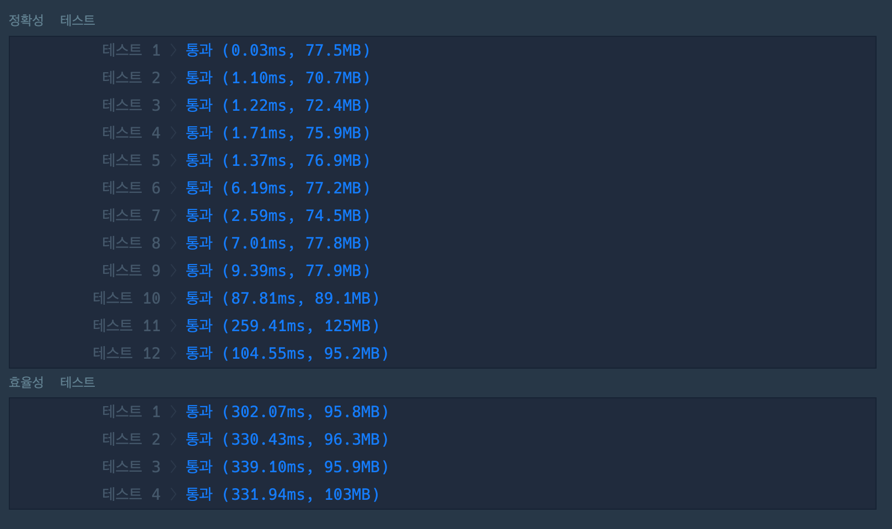

## **Intro**

소수를 찾는 세 가지 방법 중 가장 효율적인 방법은 무엇일까?!
1부터 N까지의 수 중에서 소수를 찾는 알고리즘 문제를 풀며 세 가지의 방법을 생각해냈는데,
그 중 가장 효율적으로 소수를 찾는 방법은 무엇일지 궁금하여 서로 비교해보았다.

일단 세가지 방법은 이렇다.

1. 2부터 N의 루트까지의 수를 나누어 떨어지는 값 하나도 없는 수
2. 작은 수부터 소수 리스트를 저장하여 소수 리스트에 있는 값들로 나누어 떨어지는 값이 하나도 없는 수
3. 2부터 N까지의 중 구한 소수의 배수에 해당 하는 수들을 모두 제외한 수

비교 기준은 세가지 방법으로 짠 코드를 프로그래머스 효율성 검사를 돌렸을 때 나오는 결괏 값으로 하였다.

### 1번 방법

### 2번 방법

### 3번 방법

### 비교 결과
작은수에서는 1번 방법이 유리하였지만 큰수로 갈 수록 소수리스트만 담은 2번 방법이 빠르게 작동하는 모습을 볼 수 있었다. 3번은 처음부터 큰 수들의 리스트를 담고 있었어서 인지 무거운 모습이 보였다.